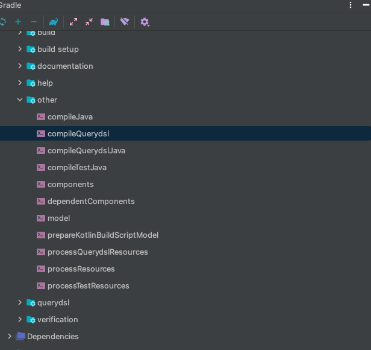

# QueryDsl


### QueryDsl 설정(의존성 및 각종 설정)

~~~groovy
group = 'study'
version = '0.0.1-SNAPSHOT'
sourceCompatibility = '1.8'
configurations {
    compileOnly {
        extendsFrom annotationProcessor
    }
}
repositories {
    mavenCentral()
}
dependencies {
    implementation 'org.springframework.boot:spring-boot-starter-data-jpa'
    implementation 'org.springframework.boot:spring-boot-starter-web'
//querydsl 추가
implementation 'com.querydsl:querydsl-jpa'
    compileOnly 'org.projectlombok:lombok'
    runtimeOnly 'com.h2database:h2'
    annotationProcessor 'org.projectlombok:lombok'
    testImplementation('org.springframework.boot:spring-boot-starter-test') {
        exclude group: ‘org.junit.vintage’, module: ‘junit-vintage-engine'
    }
}
test {
    useJUnitPlatform()
}
//querydsl 추가 시작
def querydslDir = "$buildDir/generated/querydsl"
querydsl {
    jpa = true
           querydslSourcesDir = querydslDir
  }
  sourceSets {
      main.java.srcDir querydslDir
  }
  configurations {
      querydsl.extendsFrom compileClasspath
  }
  compileQuerydsl {
      options.annotationProcessorPath = configurations.querydsl
}
//querydsl 추가 끝

~~~

강의와 동일하게 환경설정을 해줬으나, Spring의 최신버전을 쓰다보니 해당 오류가 발생했다.

- `Unable to load class 'com.mysema.codegen.model.Type'.`

  ` This is an unexpected error. Please file a bug containing the idea.log file.`


**Spring 2.6이상에서는 Querydsl 5.0 버전을 쓰는대 Query 5.0 버전은 다르게 build.gradle 세팅을 해줘야 한다.**

~~~groovy
buildscript {
	ext {
		queryDslVersion = "5.0.0"
	}
}

plugins {
	id 'org.springframework.boot' version '2.6.4'
	id 'io.spring.dependency-management' version '1.0.11.RELEASE'
	id 'java'
	//querydsl 추가
	id "com.ewerk.gradle.plugins.querydsl" version "1.0.10"
}

group = 'study'
version = '0.0.1-SNAPSHOT'
sourceCompatibility = '11'

configurations {
	compileOnly {
		extendsFrom annotationProcessor
	}
}

repositories {
	mavenCentral()
}

dependencies {
	implementation 'org.springframework.boot:spring-boot-starter-data-jpa'
	implementation 'org.springframework.boot:spring-boot-starter-web'
	compileOnly 'org.projectlombok:lombok'
	runtimeOnly 'com.h2database:h2'
	annotationProcessor 'org.projectlombok:lombok'
	testImplementation 'org.springframework.boot:spring-boot-starter-test'

	//querydsl 추가
  //의존성을 받아오는 부분도 다르다.
	implementation "com.querydsl:querydsl-jpa:${queryDslVersion}"
	implementation "com.querydsl:querydsl-apt:${queryDslVersion}"
}

tasks.named('test') {
	useJUnitPlatform()
}

//querydsl 추가 시작
def querydslDir = "$buildDir/generated/querydsl"
querydsl {
	jpa = true
	querydslSourcesDir = querydslDir
}
sourceSets {
	main.java.srcDir querydslDir
}
compileQuerydsl {
	options.annotationProcessorPath = configurations.querydsl
}
//이부분이 다르다.
configurations {
	compileOnly {
		extendsFrom annotationProcessor
	}
	querydsl.extendsFrom compileClasspath
}
~~~


**compileQuerydsl을 실행하여 QEntity 파일을 생성해준다.**




#### QueryDsl의 검색 조건 - JPQL이 제공하는 모든 검색 조건을 다 제공함

~~~java
member.username.eq("member1") // username = 'member1'
member.username.ne("member1") //username != 'member1'
member.username.eq("member1").not() // username != 'member1'

member.username.isNotNull() //이름이 is not null

member.age.in(10, 20) // age in (10,20)
member.age.notIn(10, 20) // age not in (10, 20)
member.age.between(10,30) //between 10, 30

member.age.goe(30) // age >= 30
member.age.gt(30) // age > 30
member.age.loe(30) // age <= 30
member.age.lt(30) // age < 30

member.username.like("member%") //like 검색 member.username.contains("member") // like ‘%member%’ 검색 member.username.startsWith("member") //like ‘member%’ 검색
~~~


#### 결과 조회 메서드

- `fetch()`: 리스트 조회, 데이터 없으면 빈 리스트 반환
- `fetchOne()`: 단건 조회
  - 결과가 없으면: `null`
  - 결과가 둘 이상이면: `com.querydsl.core.NonUniqueResultExecption`
- `fetchFirst()`: `limit(1).fetchOne()`
- `fetchResults()`: 페이징 정보 포함, total count 쿼리 추가 실행
- `fetchCount()`: count 쿼리로 변경해서 count 수 조회


#### 정렬

- orderBy(): 정렬 메소드

  - 정렬하고 싶은 필드를 파라미터로 넘기면 된다

  - ex) `.orderBy(member.age.desc())`

    ​	  `.orderBy(member.age.asc())`

#### 페이징

- offset(): 데이터를 몇번부터 가져올지 설정한다.
- limit(): 데이터를 offset으로부터 몇개를 가져올지 정한다.


#### 집합

#####  집합 함수

- count(): 계수 함수
- sum(): 조회된 모든 단일 컬럼의 총합을 구하는 함수
- avg(): 조회된 모든  단일 컬럼의 평균을 구하는 함수
- max(): 조회된 모든 단일 컬럼 중 최상위값을 구하는 함수
- min(): 조회된 모든 단일 컬럼 중 최하위값을 구하는 함수
- groupBy(): 파라미터를 기준으로 그룹화
- having(): 그룹화후에 조건 처리


### 조인 - 기본 조인

#### 기본 조인

조인의 기본 문법은 첫번째 파라미터에 조인 대상을 지정하고, 두번째 파라미터에 별칭(alias)으로 사용할 Q타입을 지정하면 된다.

~~~java
join(조인 대상, 별칭으로 사용할 Q타입)
~~~


#### 세타 조인

연관관계가 없는 필드로 조인

~~~java
List<Member> result = queryFactory
                .select(member)
                .from(member, team)
                .where(member.username.eq(team.name))
                .fetch();
~~~

- From 절에 여러 엔티티를 선택해서 세타 조인
- on을 사용하면 외부 조인 가능


### 조인 - on 절

- ON절을 활용한 조인(JPA 2.1 부터 지원)
  1. 조인 대상 필터링
  2. 연관관계가 없는 엔티티 외부 조인


1. 조인 대상 필터링

~~~java
List<Tuple> result = queryFactory
                .select(member, team)
                .from(member)
                .leftJoin(member.team, team).on(team.name.eq("teamA"))
                .fetch();
~~~


> 참고: ineer join을 할때 on으로 조건을 거나, where로 조건을 걸어도 똑같다. 내부 조인일때는 익숙한 where을 사용하고. on절은 외부조인이 필요한 경우에만 사용하자

```java
//동일한 결과가 출력됨

List<Tuple> result = queryFactory
        .select(member, team)
        .from(member)
        .join(member.team, team).on(team.name.eq("teamA"))
        .fetch();

List<Tuple> result = queryFactory
        .select(member, team)
        .from(member)
        .join(member.team, team)
  			.where(team.name.eq("teamA"))
        .fetch();
```


2. 연관관계가 없는 엔티티 외부 조인

```java
public void joinOnNoRelation() throws Exception{
    em.persist(new Member("teamA"));
    em.persist(new Member("teamB"));
    em.persist(new Member("teamC"));

    List<Tuple> result = queryFactory
            .select(member, team)
            .from(member)
            .leftJoin(team).on(member.username.eq(team.name))
            .fetch();

    for (Tuple tuple : result) {
        System.out.println("tuple = " + tuple);
    }
}
```

- 하이버네이트 5.1 부터 `on` 을 사용해서 서로 관계가 없는 필드로 외부 조인하는 기능이 추가되었다. 물론 내부 조인도 가능하다.
- 문법을 잘 봐야 한다. **leftJoin()** 부분에 일반 조인과 다르게 엔티티 하나만 들어간다.
  - 일반 조인: `leftJoin(member.team, team)` 
  - on 조인: `leftJoin(team).on(조건)`
    - 일반 조인은 fk를 기준으로 조인을 하나, 연관관계가 없는 조인은 on절의 조건에 맞추어서 조인을 한다.


#### 조인 - 페치 조인

페치 조인은 SQL에서 제공하는 기능은 아니다. SQL 조인을 활용해서 연관된 엔티티를 SQL 한번에 조회하는 기능이다. 주로 성능 최적화에 사용하는 방법이다.


**일반 조인 절에 .fetchJoin()만 붙여주면 된다.**

~~~java
@Test
    public void fetchJoinUse() throws Exception{
        em.flush();
        em.clear();

        Member findMember = queryFactory
                .selectFrom(member)
                .join(member.team, team).fetchJoin() 
                .where(member.username.eq("member1"))
                .fetchOne();

        boolean loaded = emf.getPersistenceUnitUtil().isLoaded(findMember.getTeam());
        assertThat(loaded).as("페치 조인 미적용").isTrue();
    }
~~~


#### 서브 쿼리

`com.querydsl.jpa.JPAExpressions` 사용

~~~java
/**
     * 나이가 가장 많은 회원 조회
     * @throws Exception
     */
    @Test
    public void subQuery() throws Exception{
        QMember memberSub = new QMember("memberSub");

        List<Member> result = queryFactory
                .selectFrom(member)
                .where(member.age.eq(
                        JPAExpressions
                                .select(memberSub.age.max())
                                .from(memberSub)
                ))
                .fetch();

        assertThat(result).extracting("age")
                .containsExactly(40);
    }
~~~

where 절에 JPAEXpressions를 사용하여 조건을 넣으면 된다.


**from절의 서브쿼리 한계**

JPA JPQL 서브쿼리 한계점으로 from 절의 서브쿼리(인라인 뷰)는 지원하지 않는다.

당연히 Querydsl도 지원하지 않는다. 하이버네이트 구현체를 사용하면 select 절의 서브 쿼리는 지원한다. Querydsl도 하이버네이트 구현체를 사용하면 select 절의 서브쿼리를 지원한다.


**from 절의 서브쿼리 해결방안**

1. 서브쿼리를 join으로 변경한다. (가능한 상황도 있고, 불가능한 상황도 있따.)
2. 애플리케이션에서 쿼리를 2번 분리해서 실행한다.
3. nativeSQL을 사용한다.


#### Case 문

**select, 조건절(where)에서 사용가능**

**간단한 조건**

~~~java
@Test
    public void basicCase() throws Exception{
        List<String> result = queryFactory
                .select(member.age
                        .when(10).then("열살")
                        .when(20).then("스무살")
                        .otherwise("기타"))
                .from(member)
                .fetch();

        for (String s : result) {
            System.out.println("s = " + s);
        }
    }
~~~


**복잡한 조건**

```java
@Test
public void complexCase() {
    List<String> result = queryFactory
            .select(new CaseBuilder()
                    .when(member.age.between(0, 20)).then("0 ~ 20살")
                    .when(member.age.between(21, 30)).then("21 ~ 30살")
                    .otherwise("기타")
            ).from(member)
            .fetch();

    for (String s : result) {
        System.out.println("s = " + s);
    }
}
```


#### 상수, 문자 더하기

상수가 필요하면 `Expressions.constant(xxx)` 사용

```java
@Test
public void constant() throws Exception{
    List<Tuple> result = queryFactory
            .select(member.username, Expressions.constant("A"))
            .from(member)
            .fetch();

    for (Tuple tuple : result) {
        System.out.println("tuple = " + tuple);
    }
}
```


**문자 더하기**

```java
@Test
public void concat() throws Exception{
    List<String> result = queryFactory
            .select(member.username.concat("_").concat(member.age.stringValue()))
            .from(member)
            .where(member.username.eq("member1"))
            .fetch();

    for (String s : result) {
        System.out.println("s = " + s);
    }
}
```

h2: 2.0.202 이후 버전 부터는 char로 캐스팅할 때 기본길이가 1로 고정되어 있다.

원래 결과는 member1_10로 출력되어야 한다.


>  참고 `member.age.stringValue()` 부분이 중요한데, 문자가 아닌 다른 타입들을 `stringValue()`로 문자로 변환할 수 있따. 이 방법은 ENUM을 처리할 때도 자주 사용한다.


### 중급 문법

#### 프로젝션과 결과 반환 - 기본

프로젝션: select 대상 지정


#### 프로젝션 대상이 하나

- 프로젝션 대상이 하나면 타입을 명확하게 지정할 수 있음
- 프로젝션 대상이 둘 이상이면 튜플이나 DTO로 조회

```java
@Test
public void simpleProjection() throws Exception{
    List<String> result = queryFactory
            .select(member.username)
            .from(member)
            .fetch();

    for (String s : result) {
        System.out.println("s = " + s);
    }
}
```


#### 튜플 조회

프로젝션 대상이 둘 이상일 때 사용

```java
@Test
public void tupleProjection() throws Exception{
    List<Tuple> result = queryFactory
            .select(member.username, member.age)
            .from(member)
            .fetch();

    for (Tuple tuple : result) {
        String username = tuple.get(member.username);
        Integer age = tuple.get(member.age);

        System.out.println("username = " + username);
        System.out.println("age = " + age);
    }
}
```

- 튜플은 Repository 안에서만 사용하는게 권장된다 왜냐하면 튜플이 querydsl에 종속적인 개념이기 때문에 서비스 또는 컨트롤러로 나갈 시 해당 부분에서 querydsl에 종속적이기 때문에 repository에서만 사용하고 외부로 내보낼 때는 DTO에 담아서 내보내도록 하자


#### 프로젝션과 결과 반환 - DTO 조회

**순수 JPA에서 DTO 조회 코드**

```java
@Test
public void findDtoByJPQL() throws Exception {
    List<MemberDto> result = em.createQuery("select new study.querydsl.dto.MemberDto(m.username, m.age) from Member m", MemberDto.class)
            .getResultList();

    for (MemberDto memberDto : result) {
        System.out.println("memberDto = " + memberDto);
    }
}
```

- 순수 JPA에서 DTO를 조회할 때는 new 명령어를 사용해야함
- DTO의 package이름을 다 적어줘야해서 지저분함
- 생성자 방식만 지원함


**Querydsl 빈 생성(Bean population)**

```java
@Test
public void findDtoBySetter() throws Exception{
    List<MemberDto> result = queryFactory
            .select(Projections.bean(MemberDto.class,
                    member.username,
                    member.age))
            .from(member)
            .fetch();

    for (MemberDto memberDto : result) {
        System.out.println("memberDto = " + memberDto);
    }
}
```

**Querydsl  필드 생성**

```java
@Test
public void findDtoByField() throws Exception{
    List<MemberDto> result = queryFactory
            .select(Projections.fields(MemberDto.class,
                    member.username,
                    member.age))
            .from(member)
            .fetch();

    for (MemberDto memberDto : result) {
        System.out.println("memberDto = " + memberDto);
    }
}
```

**DTO의 필드 이름과 엔티티의 이름이 다를 때는 as를 붙여서 별칭을 DTO에 맞게 지정해줘야 한다.**

```java
@Test
public void findUserDto() throws Exception{
    List<UserDto> result = queryFactory
            .select(Projections.fields(UserDto.class,
                    member.username.as("name"),
                    member.age))
            .from(member)
            .fetch();

    for (UserDto userDto : result) {
        System.out.println("userDto = " + userDto);
    }
}
```

**Querydsl 생성사 생성**

```
@Test
public void findDtoByConstructor() throws Exception{
    List<MemberDto> result = queryFactory
            .select(Projections.constructor(MemberDto.class,
                    member.username,
                    member.age))
            .from(member)
            .fetch();

    for (MemberDto memberDto : result) {
        System.out.println("memberDto = " + memberDto);
    }
}
```

- 생성자로 생성할 때는 파라미터 타입에 맞춰서 설정해줘야 한다.


#### 프로젝션과 결과 반환 - @QueryProjection

**생성자 + @QueryProjection**

```java
@Data
@NoArgsConstructor
public class MemberDto {
    private String username;
    private int age;

    @QueryProjection
    public MemberDto(String username, int age) {
        this.username = username;
        this.age = age;
    }
}
```


```java
@Test
public void findDtoByQueryProjection() throws Exception{
    List<MemberDto> result = queryFactory
            .select(new QMemberDto(member.username, member.age))
            .from(member)
            .fetch();

    for (MemberDto memberDto : result) {
        System.out.println("memberDto = " + memberDto);
    }
}
```

생성자 시점에 타입도 정해주고, 파라미터도 알맞게 맞아줘서 컴파일 시점에 오류가 발생해서 정말 좋지만,

단점이 하나가 존재하는데 DTO가 Querydsl에 종속적이기 때문에 DTO를 컨트롤러, 서비스 같은곳에서 쓰인다면 모든 곳에서 querydsl에 종속적으로 변하기 때문에 아키텍쳐를 설계할 때 고민을 해보는 것도 좋을것 같다.


### 동적 쿼리 - BooleanBuilder 사용

**동적 쿼리를 해결하는 두가지 방식**

- BooleanBuilder
- Where 다중 파라미터 사용

```java
@Test
public void dynamicQueryBooleanBuilder() throws Exception{
    String usernameParam = "member1";
    Integer ageParam = null;

    List<Member> result = searchMember1(usernameParam, ageParam);
    assertThat(result.size()).isEqualTo(1);
}

private List<Member> searchMember1(String usernameCond, Integer ageCond) {

    BooleanBuilder builder = new BooleanBuilder();
    if (usernameCond != null) {
        builder.and(member.username.eq(usernameCond));
    }

    if (ageCond != null) {
        builder.and(member.age.eq(ageCond));
    }

    return queryFactory
            .selectFrom(member)
            .where(builder)
            .fetch();
}
```


### 동적 쿼리 - Where 다중 파라미터 사용

```java
@Test
    public void dynamicQueryWhereParam() throws Exception{
        String usernameParam = "member1";
        Integer ageParam = null;

        List<Member> result = searchMember2(usernameParam, ageParam);
        assertThat(result.size()).isEqualTo(1);
    }

    private List<Member> searchMember2(String usernameCond, Integer ageCond) {
        return queryFactory
                .selectFrom(member)
//                .where(usernameEq(usernameCond), ageEq(ageCond))
                .where(allEq(usernameCond, ageCond))
                .fetch();
    }

    private BooleanExpression usernameEq(String usernameCond) {
        return usernameCond == null ? null : member.username.eq(usernameCond);

    }

    private BooleanExpression ageEq(Integer ageCond) {
        return ageCond == null ? null : member.age.eq(ageCond);
    }
```

- `where` 조건에 `null` 값은 무시된다.
- 메서드를 다른 쿼리에서도 재활용 할 수 있다.
- 쿼리 자체의 가독성이 높아진다.


**조합 가능**

```java
private BooleanExpression allEq(String usernameCond, Integer ageCond) {
    return usernameEq(usernameCond).and(ageEq(ageCond));
}
```


> **주의 사항: `null` 체크는 주의해서 처리해야 한다.**


### 수정, 삭제 벌크 연산

~~~java
@Test
    @Commit
    public void bulkUpdate() throws Exception{
        long count = queryFactory
                .update(member)
                .set(member.username, "비회원")
                .where(member.age.lt(28))
                .execute();

        em.flush();// 벌크 연산 시 영속성 컨텍스트를 초기화 해준다.
        em.clear();

        List<Member> result = queryFactory
                .selectFrom(member)
                .fetch();

        for (Member member1 : result) {
            System.out.println("member1 = " + member1);
        }
    }
~~~

- 벌크 연산 시 쿼리를 영속성 컨텍스트의 1차쿼리를 거치는 것이 아닌 바로 DB에 쿼리를 전달한다. 그렇게 되면 엔티티를 조회할 때, DB와 영속성 컨텍스트의 데이터가 다른데, 그때 JPA는 영속성 컨텍스트에 캐싱되어있는 데이터를 우선으로 한다. 

  그렇기 때문에 데이터 싱크를 맞추기 위해선 영속성 컨텍스트를 초기화 해준 뒤, member를 조회한다.


**더하기**

```java
@Test
public void bulkAdd() throws Exception{
    queryFactory
            .update(member)
            .set(member.age, member.age.add(1))
            .execute();
}
```


**삭제**

```java
@Test
public void bulkDelete() throws Exception {
    long count = queryFactory
            .delete(member)
            .where(member.age.gt(18))
            .execute();
}
```


#### SQL function 호출

```java
@Test
    public void sqlFunction() throws Exception{
        List<String> result = queryFactory
                .select(
                        Expressions.stringTemplate(
                                "function('replace', {0}, {1}, {2})",
                                member.username, "member", "M")
                ).from(member)
                .fetch();

        for (String s : result) {
            System.out.println("s = " + s);
        }
    }

    @Test
    public void sqlFunction2() throws Exception{
        List<String> result = queryFactory
                .select(member.username)
                .from(member)
//                .where(member.username.eq(Expressions.stringTemplate("function('lower', {0})", member.username)))
                .where(member.username.eq(member.username.lower()))// 기본적으로 querydsl이 내장하고 있다.
                .fetch();

        for (String s : result) {
            System.out.println("s = " + s);
        }
    }
```

Expressions를 사용하여 SQL function을 호출하면된다.

그리고 기본적으로 querydsl에서 내장하는 ANSI표준 function들은 entity.filed.function()이런식으로 호출하면 된다.


#### BooleanBuilder를 이용한 동적쿼리와 성능 최적화 조회

```java
public List<MemberTeamDto> searchByBuilder(MemberSearchCondition condition) {
    BooleanBuilder builder = new BooleanBuilder();
    if (hasText(condition.getUsername())) {
        builder.and(member.username.eq(condition.getUsername()));
    }
    if(hasText(condition.getTeamName())){
        builder.and(team.name.eq(condition.getTeamName()));
    }
    if (condition.getAgeGoe() != null) {
        builder.and(member.age.goe(condition.getAgeGoe()));
    }
    if (condition.getAgeLoe() != null) {
        builder.and(member.age.loe(condition.getAgeLoe()));
    }

    return queryFactory
            .select(new QMemberTeamDto(
                    member.id,
                    member.username,
                    member.age,
                    team.id,
                    team.name))
            .from(member)
            .leftJoin(member.team, team)
            .where(builder)
            .fetch();
}
```


